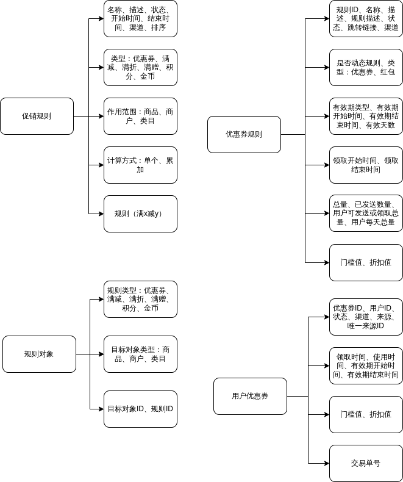
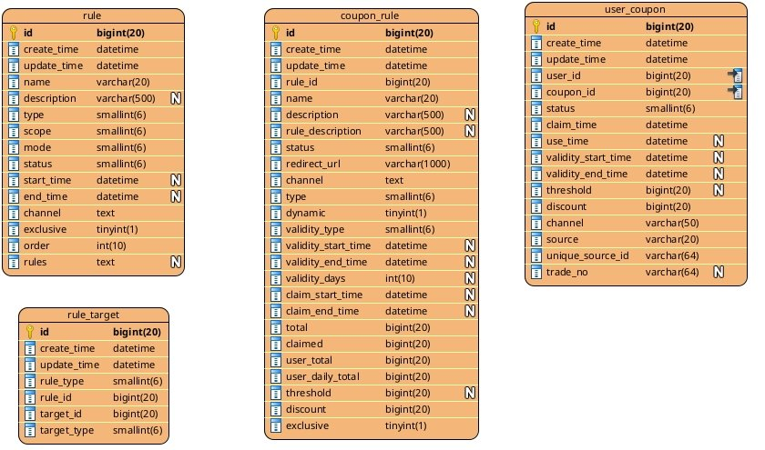

# promotion-center

促销系统

# 依赖

依赖[parent-pom](https://github.com/pulllock/parent-pom)和[general-starter](https://github.com/pulllock/general-starter)项目，具体使用方法可以参考对应项目的文档。

# 性能测试

## jmeter

jmeter测试计划脚本在项目根目录下的jmeter目录中：[jmeter](./jmeter)

# 接口调用示例

## http-client

接口调用示例在目录：[http-client](./http-client)中

## springdoc/swagger

访问地址：http://localhost:8080/swagger-ui/index.html

# sql文件

sql文件在目录：[sql](./sql)中

# 设计方案

## 促销构成

## ER图

